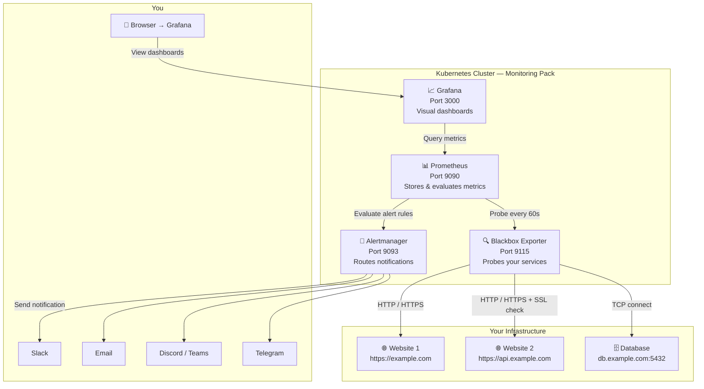

# Monitoring Pack

[](https://helm.sh)
[](https://kubernetes.io)
[](LICENSE)
[](https://github.com/your-org/monitoring-pack/actions/workflows/ci.yml)

> Production-ready, self-hosted website and SSL monitoring for Kubernetes.
> One command to deploy. Everything pre-configured. Zero SaaS.

**Monitoring Pack** bundles Prometheus, Grafana, Alertmanager, and Blackbox Exporter into a single Helm chart with pre-built dashboards, alert rules, and notification support for Slack, Email, Discord, Teams, and Telegram. Edit `values.yaml` to add your websites — the chart handles the rest.

---

## Table of Contents

1. [What Does It Do?](#what-does-it-do)
2. [How It Works](#how-it-works)
3. [What Each Component Does](#what-each-component-does)
4. [Prerequisites](#prerequisites)
5. [Quick Start](#quick-start)
6. [Installation](#installation)
   - [Standalone Mode](#standalone-mode-default)
   - [Integration with kube-prometheus-stack](#integration-with-kube-prometheus-stack)
7. [Configuration Guide](#configuration-guide)
   - [Adding Websites](#adding-websites)
   - [Monitoring Authenticated Endpoints](#monitoring-authenticated-endpoints)
   - [Probe Types](#probe-types)
   - [TCP, DNS, and ICMP Targets](#tcp-dns-and-icmp-targets)
   - [Alert Thresholds](#alert-thresholds)
   - [SLO / Error Budget Alerting](#slo--error-budget-alerting)
   - [Environment Labels](#environment-and-team-labels)
   - [Persistent Storage](#persistent-storage)
   - [Exposing Grafana](#exposing-grafana)
8. [Setting Up Notifications](#setting-up-notifications)
   - [Slack](#slack)
   - [Email](#email)
   - [Discord](#discord)
   - [Microsoft Teams](#microsoft-teams)
   - [Telegram](#telegram)
   - [PagerDuty](#pagerduty)
   - [Opsgenie](#opsgenie)
   - [Generic Webhook](#generic-webhook)
9. [Grafana Dashboard](#grafana-dashboard)
   - [Public Status Page](#public-status-page)
10. [Alert Rules Reference](#alert-rules-reference)
    - [Maintenance Windows](#maintenance-windows)
    - [Escalation Policies](#escalation-policies)
11. [Multiple Environments](#multiple-environments)
    - [Multi-Cluster Visibility (remote_write)](#multi-cluster-visibility-remote_write)
12. [High Availability](#high-availability)
13. [Security Hardening](#security-hardening)
14. [Upgrade](#upgrade)
15. [Uninstall](#uninstall)
16. [Troubleshooting](#troubleshooting)
17. [FAQ](#faq)
18. [Dashboard Screenshots](#dashboard-screenshots)
19. [Contributing](#contributing)
20. [Changelog](#changelog)

---

## What Does It Do?

Monitoring Pack checks your websites and APIs every minute and tells you when something is wrong — before your users notice.

| What it monitors | How it tells you |
|-----------------|-----------------|
| Is my website up or down? | Slack, Email, Discord, Teams, Telegram |
| How fast is it responding? | Grafana dashboard + alert if > 2s |
| Is my SSL certificate about to expire? | Alert 30 days before expiry |
| Is my SSL certificate using TLS 1.3? | Dashboard shows TLS version |
| Can I connect to my database port? | TCP probe |
| Does my domain resolve correctly? | DNS probe |
| Can I ping my server? | ICMP probe |

---

## How It Works



**The flow in plain English:**
1. **Blackbox Exporter** makes real HTTP requests to your websites, just like a browser would.
2. **Prometheus** asks the Blackbox Exporter "did the probe succeed?" every 60 seconds and saves the result. Alert rules are evaluated every 30 seconds.
3. When a rule fires (e.g., website down for 1 minute), **Alertmanager** sends you a notification within ~10 seconds.
4. **Grafana** reads Prometheus data and shows you beautiful charts and history.

---

## What Each Component Does

### Prometheus
Think of Prometheus as a **time-series database with a brain**. It:
- Scrapes metrics from Blackbox Exporter every 60 seconds
- Stores every data point with a timestamp
- Evaluates alert rules (`if website_down > 2 minutes, fire alert`)
- Keeps up to 30 days of data by default

### Grafana
Grafana is the **visual layer** — it turns raw numbers into graphs you can understand:
- Pre-built dashboard with 19 panels (auto-provisioned, no setup needed)
- Shows uptime history, response times, SSL expiry countdowns, TLS versions
- Login with `admin` / your configured password

### Alertmanager
Alertmanager is the **notification router**. It:
- Receives alerts from Prometheus
- Groups related alerts (so you don't get 50 messages for the same problem)
- Sends to your chosen channels: Slack, Email, Discord, Teams, Telegram
- Handles "resolved" notifications when things recover

### Blackbox Exporter
Blackbox Exporter is the **active probe**. It:
- Makes real HTTP/HTTPS requests to your websites
- Checks SSL certificate validity and expiry
- Resolves DNS, connects via TCP, sends ICMP pings
- Reports timing for each phase: DNS lookup → TCP connect → TLS handshake → server response → transfer

---

## Prerequisites

Before installing, make sure you have:

| Requirement | Minimum version | How to check |
|-------------|----------------|--------------|
| Kubernetes cluster | 1.21+ | `kubectl version` |
| Helm | 3.8+ | `helm version` |
| A default StorageClass | Any | `kubectl get storageclass` |

**Don't have a cluster?** These work great for local testing:
- [Kind](https://kind.sigs.k8s.io/) — `kind create cluster`
- [Minikube](https://minikube.sigs.k8s.io/) — `minikube start`
- [k3s](https://k3s.io/) — single-command install for Linux servers

**For local testing without persistent storage**, use `examples/values-minimal.yaml` which disables PVCs.

---

## Quick Start

```bash
# 1. Create a namespace
kubectl create namespace monitoring

# 2. Install with defaults (monitors google.com + example.com)
helm install website-monitor . \
  --namespace monitoring \
  --set grafana.adminPassword=my-secure-password

# 3. Access Grafana
kubectl port-forward -n monitoring \
  svc/website-monitor-monitoring-pack-grafana 3000:3000

# 4. Open http://localhost:3000
#    Username: admin   Password: my-secure-password
```

That's it. The "Website Monitoring Dashboard" is already imported. Within 2 minutes you'll see live data.

---

## Installation

### Standalone Mode (default)

Standalone mode deploys all four components (Prometheus, Grafana, Alertmanager, Blackbox Exporter). This is the **recommended starting point** — no external dependencies needed.

#### Step 1 — Create your values file

Copy and edit `values.yaml`:

```bash
cp values.yaml my-values.yaml
```

Edit `my-values.yaml` — at minimum, replace the example targets with your own websites:

```yaml
targets:
  - name: My Website
    url: https://example.com
  - name: My API
    url: https://api.example.com

grafana:
  adminPassword: "choose-a-strong-password"
```

#### Step 2 — Install

```bash
helm install website-monitor . \
  --namespace monitoring \
  --create-namespace \
  -f my-values.yaml
```

#### Step 3 — Watch it come up

```bash
kubectl get pods -n monitoring -w
```

All pods should reach `Running` within 60–90 seconds.

#### Step 4 — Access Grafana

```bash
kubectl port-forward -n monitoring \
  svc/website-monitor-monitoring-pack-grafana 3000:3000
```

Open **http://localhost:3000** → log in → look for "Website Monitoring Dashboard".

---

### Integration with kube-prometheus-stack

If you already have [kube-prometheus-stack](https://github.com/prometheus-community/helm-charts/tree/main/charts/kube-prometheus-stack) installed, you can plug Monitoring Pack into it instead of running a separate Prometheus/Grafana stack.

**What this mode deploys:**
- Blackbox Exporter (the probe)
- `ServiceMonitor` resources (so your existing Prometheus discovers the targets)
- `PrometheusRule` resource (so your existing Prometheus evaluates the alert rules)
- Grafana dashboard ConfigMap (auto-discovered by the Grafana sidecar)

**Step 1 — Find your kube-prometheus-stack release name:**

```bash
helm list -n monitoring
# Look for the kube-prometheus-stack release name, e.g., "kps"
```

**Step 2 — Configure values:**

```yaml
# Disable standalone components
prometheus:
  enabled: false
grafana:
  enabled: false
alertmanager:
  enabled: false

# Enable operator integration
serviceMonitor:
  enabled: true
  # Must match your Prometheus CR's serviceMonitorSelector
  labels:
    release: kps       # Replace with your kube-prometheus-stack release name

prometheusRule:
  enabled: true
  labels:
    release: kps       # Same label

# Auto-import dashboard into existing Grafana
grafana:
  enabled: false       # Don't deploy Grafana
  dashboardLabels:
    grafana_dashboard: "1"   # Grafana sidecar auto-discovers this

# Your targets
targets:
  - name: My Website
    url: https://example.com
  - name: My API
    url: https://api.example.com
```

**Step 3 — Install:**

```bash
helm install website-monitor . \
  --namespace monitoring \
  -f my-values.yaml
```

**Step 4 — Verify targets are discovered:**

```bash
# Open your existing Prometheus
kubectl port-forward -n monitoring svc/kps-prometheus 9090:9090
# Go to http://localhost:9090/targets and look for "blackbox-http" jobs
```

#### Using Probe CRD (recommended for prometheus-operator v0.47+)

An alternative to `serviceMonitor` is the `Probe` CRD — it's simpler and designed specifically for Blackbox-style probing:

```yaml
probe:
  enabled: true
  labels:
    release: kps
```

This creates `Probe` CRD resources instead of `ServiceMonitor` resources. The `Probe` CRD is more expressive and requires less relabeling configuration.

---

## Configuration Guide

### Adding Websites

All monitoring targets live under `targets` in `values.yaml`. Just add entries to the list:

```yaml
targets:
  # Basic HTTPS monitoring
  - name: My Homepage
    url: https://example.com

  # Monitor with a faster interval
  - name: Payment API
    url: https://payments.example.com
    interval: 30s      # Check every 30 seconds (default: 60s)

  # Self-signed certificate? Skip TLS verification
  - name: Internal Dashboard
    url: https://internal.company.local
    module: http_2xx_no_ssl_verify

  # HTTP (no SSL) — still monitored, just no SSL check
  - name: Legacy Service
    url: http://legacy.example.com
```

**Tip:** SSL certificates are automatically checked for all `https://` URLs. You don't need to add anything extra for SSL monitoring.

### Monitoring Authenticated Endpoints

Set `headers`, `bearerToken`, or `basicAuth` on any target and Monitoring Pack generates a dedicated Blackbox Exporter module for it — no manual ConfigMap editing needed. Use at most one of the three per target:

```yaml
targets:
  - name: Internal API
    url: https://api.internal.example.com/healthz
    headers:
      X-API-Key: "your-api-key"

  - name: Partner Webhook Health
    url: https://partner.example.com/status
    bearerToken: "your-bearer-token"

  - name: Legacy Admin Panel
    url: https://admin.example.com
    basicAuth:
      username: "monitoring"
      password: "your-password"
```

Store real credentials in a Kubernetes Secret and inject them via `--set-file`/CI secrets rather than committing them to `values.yaml`.

### Probe Types

The `module` field controls what kind of check is performed:

| Module | What it checks |
|--------|---------------|
| `http_2xx` | HTTP/HTTPS — expects a 2xx response code (default) |
| `http_post_2xx` | Same but sends POST requests |
| `http_2xx_no_ssl_verify` | HTTPS without TLS certificate verification |
| `ssl_expiry` | Applied automatically to all https:// targets |
| `tcp_connect` | Used for `tcpTargets` |
| `dns_check` | Used for `dnsTargets` |
| `icmp` | Used for `icmpTargets` (requires `blackboxExporter.privileged: true`) |

### TCP, DNS, and ICMP Targets

```yaml
# TCP — verify a port is open
tcpTargets:
  - name: PostgreSQL
    host: "db.example.com:5432"
  - name: Redis
    host: "cache.example.com:6379"
    interval: 30s

# DNS — verify a domain resolves. Each target is queried against a real
# resolver (dns.defaultResolver below), so "host" is the domain you want
# resolved, NOT a DNS server.
dnsTargets:
  - name: Main Domain
    host: "example.com"
  - name: Internal Domain
    host: "internal.corp.local"
    resolver: "10.0.0.2:53"   # Override the default resolver for this target
    recordType: "A"           # A, AAAA, MX, TXT, CNAME, NS, SOA, SRV (default: A)

# Default resolver used to answer dnsTargets queries above. Change this if
# public resolvers are blocked from your cluster's egress.
dns:
  defaultResolver: "1.1.1.1:53"

# ICMP (Ping) — requires privileged: true!
icmpTargets:
  - name: Load Balancer
    host: "10.0.0.1"

blackboxExporter:
  privileged: true   # Required for ICMP
```

> **Why does DNS need a "resolver"?** Blackbox Exporter's DNS prober queries
> whatever address you give it as `target` and asks it to resolve a domain
> name fixed in the module config — it does not support "check if this
> domain resolves" as a single dynamic parameter. Monitoring Pack works
> around this by generating one Blackbox Exporter module per DNS target
> (with `query_name` set to your domain) and scraping it against a resolver.
> This is also why `dnsTargets` needs a real, reachable DNS server address —
> pointing `resolver` at the domain itself won't do what you'd expect.

### Alert Thresholds

Fine-tune when alerts fire:

```yaml
alerts:
  ssl:
    warningDays: 30    # Warn when cert expires in < 30 days
    criticalDays: 7    # Critical when < 7 days

  responseTime:
    warning: 2.0       # Warn when response > 2 seconds
    critical: 5.0      # Critical when response > 5 seconds

  downFor: "1m"        # Must be down for 1 minute before alerting
                       # (prevents false alarms from brief hiccups)
```

### SLO / Error Budget Alerting

`WebsiteDown` tells you a site is down *right now*. That's not the same as
"are we on track to meet our reliability target this month?" — a site that
flaps between up and down for hours can burn through a whole month's error
budget without ever failing the 1-minute `downFor` threshold. Monitoring Pack
adds Google SRE workbook-style **multi-window multi-burn-rate** alerting on
top of `WebsiteDown` to catch that:

```yaml
slo:
  enabled: true
  objectivePercent: 99.9   # Target availability, e.g. 99.9 = "three nines"
  window: "30d"            # Rolling window for the error-budget-remaining calculation
```

This adds two alerts, evaluated across every HTTP(S) target:

| Alert | Fires when | Severity | Time to fire |
|-------|-----------|----------|---------------|
| `ErrorBudgetBurnFast` | Burning the error budget at >14.4x the sustainable rate (1h **and** 5m windows) | 🔴 Critical | ~2 min |
| `ErrorBudgetBurnSlow` | Burning the error budget at >6x the sustainable rate (6h **and** 30m windows) | 🟡 Warning | ~15 min |

The 14.4x/6x multipliers are the standard values from Google's SRE workbook,
calibrated for a 30-day rolling window regardless of what you set
`slo.window` to (changing `window` only affects the error-budget-remaining
number shown on the dashboard, not the burn-rate alert calibration).

The dashboard's **🎯 SLO & Error Budget** row shows remaining budget per
target (now and over time) and a compliance table sorted worst-first, so the
target closest to breaching its objective always surfaces at the top.

### Environment and Team Labels

If you run this in multiple environments (dev, staging, production), use global labels to distinguish them. These labels appear on every Kubernetes resource and every Prometheus metric.

```yaml
global:
  environment: production   # dev, staging, production
  team: platform            # Which team owns this
  application: website-monitoring
```

This makes it easy to filter metrics in Grafana: `probe_success{environment="production"}`.

### Persistent Storage

By default, Monitoring Pack creates PersistentVolumeClaims to keep your data across pod restarts **and `helm upgrade`**:

```yaml
prometheus:
  persistence:
    enabled: true
    size: "20Gi"
    storageClass: ""   # Uses cluster default — or specify e.g. "fast-ssd"

grafana:
  persistence:
    enabled: true
    size: "5Gi"

alertmanager:
  persistence:
    enabled: true
    size: "2Gi"
```

What is preserved across upgrades:

| Component | What's kept |
|-----------|-------------|
| Prometheus | All metric history (up to 30 days) — historical anomalies are traceable |
| Grafana | Dashboard edits, annotations, user accounts |
| Alertmanager | Notification log, silences, inhibition state — resolved alerts send correctly |

**Kind / Minikube:** Works out of the box. Both ship with a `local-path` / `standard` StorageClass. No extra configuration needed.

**For environments with no StorageClass:**

```yaml
prometheus:
  persistence:
    enabled: false
grafana:
  persistence:
    enabled: false
alertmanager:
  persistence:
    enabled: false
```

**PVCs survive `helm uninstall`** — they're annotated with `helm.sh/resource-policy: keep` so you don't lose data accidentally. To delete them:

```bash
kubectl delete pvc -n monitoring -l app.kubernetes.io/instance=website-monitor
```

### Exposing Grafana

**Option 1: Port-forward (development)**
```bash
kubectl port-forward -n monitoring \
  svc/website-monitor-monitoring-pack-grafana 3000:3000
# Open http://localhost:3000
```

**Option 2: NodePort (simple clusters)**
```yaml
grafana:
  service:
    type: NodePort
    nodePort: 30300   # Access at http://<node-ip>:30300
```

**Option 3: Ingress with TLS (production)**
```yaml
grafana:
  ingress:
    enabled: true
    className: nginx
    annotations:
      cert-manager.io/cluster-issuer: letsencrypt-prod
      nginx.ingress.kubernetes.io/ssl-redirect: "true"
    host: grafana.example.com
    tls:
      - secretName: grafana-tls
        hosts:
          - grafana.example.com
```

---

## Setting Up Notifications

### Slack

**Step 1:** Go to [https://api.slack.com/apps](https://api.slack.com/apps) → "Create New App" → "From scratch"

**Step 2:** In your app settings, click "Incoming Webhooks" → enable it → "Add New Webhook to Workspace"

**Step 3:** Choose the channel and copy the webhook URL

**Step 4:** Add to `values.yaml`:

```yaml
notifications:
  slack:
    enabled: true
    webhookUrl: "https://hooks.slack.com/services/T.../B.../..."
    channel: "#website-alerts"
    username: "Monitoring Pack"
```

**What you'll receive:**

```
🛰️ Monitoring Pack
🚨 Critical alert — immediate action required

🔴 [FIRING:1] WebsiteDown          ← red left sidebar
──────────────────────────────────────────────
🌐 Target    `https://example.com`
🔴 Severity  `CRITICAL`
📄 Summary   Website down: https://example.com
✏️  Detail    https://example.com has been unreachable for more than 1m
🕐 Since     `Jun 23, 2026 10:39 UTC`
🏷️  Job       `blackbox-http`

Monitoring Pack
```

Resolved alerts send a matching `✅ [RESOLVED]` message with a green sidebar.

> **Tip:** Never commit your webhook URL to git. Use a Kubernetes Secret or store it in your CI/CD secrets store.

---

### Email

Uses any SMTP server. Example with Gmail:

> **Gmail note:** You need an App Password, not your regular password.
> Google Account → Security → 2-Step Verification → App passwords

```yaml
notifications:
  email:
    enabled: true
    smarthost: "smtp.gmail.com:587"
    from: "alerts@example.com"
    to: "oncall@example.com"
    username: "alerts@example.com"
    password: "xxxx-xxxx-xxxx-xxxx"   # App password
    requireTLS: true
```

**Other SMTP providers:**

| Provider | smarthost |
|----------|-----------|
| Gmail | `smtp.gmail.com:587` |
| Outlook / Office 365 | `smtp.office365.com:587` |
| SendGrid | `smtp.sendgrid.net:587` |
| Amazon SES | `email-smtp.us-east-1.amazonaws.com:587` |

---

### Discord

Discord webhooks support a Slack-compatible format. Append `/slack` to your webhook URL.

**Step 1:** In Discord, go to your server → channel settings → Integrations → Webhooks → New Webhook → Copy URL

**Step 2:** Append `/slack` to the URL:
```
https://discord.com/api/webhooks/123456789/XXXXX/slack
                                                  ^^^^^^
```

**Step 3:**
```yaml
notifications:
  discord:
    enabled: true
    webhookUrl: "https://discord.com/api/webhooks/123456789/XXXXX/slack"
```

---

### Microsoft Teams

**Step 1:** In Teams, go to your channel → `···` menu → Connectors → "Incoming Webhook" → Configure

**Step 2:** Give it a name and copy the webhook URL

**Step 3:**
```yaml
notifications:
  teams:
    enabled: true
    webhookUrl: "https://outlook.office.com/webhook/..."
```

---

### Telegram

**Step 1:** Open Telegram and message `@BotFather` → `/newbot` → follow prompts → copy the **token**

**Step 2:** Add your bot to the group or channel where you want alerts

**Step 3:** Find your chat ID by visiting:
```
https://api.telegram.org/bot<YOUR_TOKEN>/getUpdates
```
Look for `"chat":{"id":-1001234567890}` — the negative number is your chat ID.

**Step 4:**
```yaml
notifications:
  telegram:
    enabled: true
    botToken: "1234567890:AAFxxxxxxxxxx"
    chatId: "-1001234567890"   # Negative = group/channel
```

---

### PagerDuty

**Step 1:** In PagerDuty, create a Service (or use an existing one) → Integrations → "Add an integration" → choose **Events API v2**

**Step 2:** Copy the **Integration Key**

**Step 3:**
```yaml
notifications:
  pagerduty:
    enabled: true
    routingKey: "your-integration-key"
    severityLabel: "severity"   # Alert label to map to PagerDuty severity (critical/warning)
```

Critical alerts page immediately; warning alerts create a low-urgency incident. Resolved alerts automatically resolve the PagerDuty incident.

---

### Opsgenie

**Step 1:** In Opsgenie, go to Teams → your team → Integrations → Add integration → **API**

**Step 2:** Copy the API key

**Step 3:**
```yaml
notifications:
  opsgenie:
    enabled: true
    apiKey: "your-api-key"
    apiUrl: "https://api.opsgenie.com/"   # EU tenants: https://api.eu.opsgenie.com/
```

Critical alerts are tagged priority `P1`; everything else is `P3`.

---

### Generic Webhook

For incident tools without a native receiver above (Jira Service Management, ServiceNow, internal automation, n8n, etc.), Alertmanager can POST its raw JSON payload to any URL:

```yaml
notifications:
  webhook:
    enabled: true
    url: "https://your-tool.example.com/webhook"
    basicAuth:
      username: ""   # Optional
      password: ""
```

See the [Alertmanager webhook payload format](https://prometheus.io/docs/alerting/latest/configuration/#webhook_config) for what your endpoint will receive.

---

## Grafana Dashboard

The **Website Monitoring Dashboard** is automatically provisioned when Grafana starts. You don't need to import anything manually.

To access: open Grafana → Dashboards → "Website Monitoring Dashboard"

Use the **Target** dropdown at the top of the dashboard to drill down into one or more specific targets — every panel (including the summary stats) filters to your selection. Leave it on "All" for the fleet-wide view.

### Dashboard Sections

The dashboard is organized with the most critical information at the top:

| Section | What it shows |
|---------|-------------|
| **⚡ Live Health Status** | 6 stat cards with sparklines — **Sites Down first** (most critical), then Up, Availability %, Avg Response, SSL expiring, Total. Cards have colored backgrounds (red/green/orange). |
| **📊 Uptime History** | Full-width state timeline (10 rows tall) showing UP/DOWN history per target — instant visual pattern recognition |
| **🌐 Website Status** | Table with ✓ UP / ✗ DOWN color-coded cells, response time, HTTP status code, SSL days, TLS version |
| **🚀 Response Performance** | Line chart with fill gradient + HTTP phase breakdown (DNS / TCP / TLS / Server / Transfer) |
| **🔒 SSL Certificate Health** | Gauge per target showing days until expiry + trend chart |
| **🛡️ TLS & DNS Details** | TLS version table + DNS lookup time chart |
| **📈 Availability History (SLA)** | Probe success history + SLA table (1h / 6h / 24h / 7d / 30d) |
| **🔌 TCP / DNS / ICMP** | Collapsed row — expand to see TCP/DNS/ping probe results |
| **🎯 SLO & Error Budget** | Error budget remaining (now + trend) and a compliance table sorted worst-first for fast root-cause triage |
| **📶 Latency Percentiles** | p50/p95/p99 response latency per target over a rolling 1h window |

Dashboard auto-refreshes every **30 seconds**.

### Using the Dashboard with kube-prometheus-stack

If you're using an existing Grafana (from kube-prometheus-stack), add this to your values to auto-import the dashboard:

```yaml
grafana:
  dashboardLabels:
    grafana_dashboard: "1"   # Discovered by Grafana sidecar
```

Or import it manually: Dashboards → Import → paste the JSON from `dashboards/website-monitoring.json`.

### Public Status Page

Publish the dashboard for anonymous viewing — combine with `grafana.ingress` for a Better Stack/Statuspage-style public page:

```yaml
grafana:
  statusPage:
    enabled: true
  ingress:
    enabled: true
    className: nginx
    host: status.example.com
    tls:
      - secretName: status-tls
        hosts: [status.example.com]
```

Visitors land directly on the Website Monitoring Dashboard with no login prompt. **Read this before enabling:** Grafana's anonymous access is org-wide, not scoped to one dashboard — anonymous Viewers can open any other dashboard in the org and run ad-hoc queries against the Prometheus datasource. Only enable this on a Grafana instance with nothing else in it you'd mind being public. See the "PUBLIC STATUS PAGE" comment in `values.yaml` for the full trade-off versus Grafana's newer (but Helm-unfriendly, API-provisioned) per-dashboard public-dashboards feature.

---

## Alert Rules Reference

14 alert rules plus 6 recording rules are included, organized into 5 groups:

### Website Availability

| Alert | When it fires | Severity |
|-------|-------------|---------|
| `WebsiteDown` | Target unreachable for **1 minute** | 🔴 Critical |
| `SlowResponseTimeWarning` | Response time > 2s for **3 minutes** | 🟡 Warning |
| `SlowResponseTimeCritical` | Response time > 5s for **1 minute** | 🔴 Critical |
| `UnexpectedHTTPStatus` | HTTP status ≥ 400 for **2 minutes** | 🟡 Warning (suppressed if `WebsiteDown` fires for same target) |

### SSL Certificates

| Alert | When it fires | Severity |
|-------|-------------|---------|
| `SSLCertExpiringSoon` | Certificate expires in < 30 days (for 30 min) | 🟡 Warning |
| `SSLCertExpiringCritical` | Certificate expires in < 7 days (for 30 min) | 🔴 Critical |
| `SSLCertExpired` | Certificate has expired | 🔴 Critical |
| `SSLProbeFailed` | Cannot establish TLS connection for 5 min | 🔴 Critical |

### TCP / DNS / ICMP

| Alert | When it fires | Severity |
|-------|-------------|---------|
| `TCPConnectionFailed` | Cannot connect via TCP for 2 minutes | 🔴 Critical |
| `DNSResolutionFailed` | DNS lookup fails for 2 minutes | 🔴 Critical |
| `ICMPProbeFailed` | Ping fails for 5 minutes | 🟡 Warning |

### Internal Health

| Alert | When it fires | Severity |
|-------|-------------|---------|
| `BlackboxExporterDown` | Blackbox Exporter unreachable for 2 minutes | 🔴 Critical |

### SLO / Error Budget

See [SLO / Error Budget Alerting](#slo--error-budget-alerting) for the full explanation.

| Alert | When it fires | Severity |
|-------|-------------|---------|
| `ErrorBudgetBurnFast` | Burning the error budget >14.4x sustainable rate (1h and 5m) | 🔴 Critical |
| `ErrorBudgetBurnSlow` | Burning the error budget >6x sustainable rate (6h and 30m) | 🟡 Warning |

All thresholds are configurable in `values.yaml` under the `alerts` and `slo` keys.

### Alert Timing

Understanding the delay between an outage and the Slack notification:

```
Endpoint goes down
  ↓  up to 60s   — wait for next Blackbox probe scrape
  ↓  up to 30s   — Prometheus evaluates alert rules every 30s
  ↓  1 minute    — for: 1m must expire (prevents false alarms from blips)
  ↓  ~10s        — Alertmanager group_wait before first notification
  = worst case ~2.5 minutes from outage to Slack message
```

**Key settings that affect timing:**

| Setting | Default | Effect |
|---------|---------|--------|
| `prometheus.scrapeInterval` | `60s` | How often Blackbox is polled |
| `prometheus.scrapeTimeout` | `20s` | Must be ≥ blackbox module timeout (15s) |
| `prometheus.evaluationInterval` | `30s` | How often alert rules are evaluated |
| `alerts.downFor` | `1m` | Consecutive failure window before alert fires |
| `alertmanager.groupWait` | `10s` | Delay before first notification in a new group |
| `alertmanager.repeatInterval` | `6h` | How often to re-notify if still firing |

> **Important:** `scrapeTimeout` must be **greater than** the blackbox module probe timeout (15s) and **less than** `scrapeInterval`. Violating this causes false-positive alerts.

### Alert Inhibition Rules

To avoid alert spam, firing `WebsiteDown` automatically suppresses these alerts for the **same target**:
- `UnexpectedHTTPStatus` — already implied by the site being down
- `SlowResponseTimeWarning` / `SlowResponseTimeCritical` — response time is meaningless when site is unreachable

If `BlackboxExporterDown` fires, **all** probe alerts are suppressed (they'd all be false positives).

### Maintenance Windows

Silence notification delivery during planned maintenance without touching alert rules or manually creating Alertmanager silences (which reset on every restart unless persistence is enabled). Backed natively by Alertmanager's `time_intervals` — no extra components required. Alerts still evaluate and remain visible in the Prometheus/Alertmanager UIs; only notification delivery is muted.

```yaml
maintenanceWindows:
  - name: weekly-deploy-window
    weekdays: ["saturday"]              # monday..sunday
    times:
      - start_time: "02:00"
        end_time: "04:00"
    location: "UTC"                     # IANA timezone, e.g. "America/New_York"

  - name: black-friday-freeze
    months: ["november"]
    daysOfMonth: ["24:29"]
    location: "UTC"
```

Multiple entries are combined — if any window is currently active, notifications are muted. See [Alertmanager's `time_intervals` docs](https://prometheus.io/docs/alerting/latest/configuration/#time_interval-0) for the full range/syntax options (`weekdays`, `daysOfMonth`, `months`, `years`, `times`).

### Escalation Policies

Most teams without their own PagerDuty/Opsgenie escalation chain still want one basic guarantee: *if a critical alert sits unresolved for N minutes, tell someone else too.* Monitoring Pack implements this generically over Prometheus's own `ALERTS` metric — it doesn't matter which alert it is (`WebsiteDown`, `SSLCertExpired`, `ErrorBudgetBurnFast`, anything with `severity: critical`), no per-alert duplication needed:

```yaml
alerts:
  escalation:
    enabled: true
    after: "15m"   # Escalate if still critical after this long

notifications:
  escalation:
    pagerdutyRoutingKey: ""   # Typically a secondary on-call schedule
    opsgenieApiKey: ""
    webhookUrl: ""
```

This *adds* a channel on top of the normal critical routing — it doesn't replace it. The escalation notification includes `original_alertname` so you know which underlying alert triggered it, e.g. "ESCALATION: WebsiteDown unresolved for over 15m". Set at least one of the three channels above or escalation has nothing to notify.

---

## Multiple Environments

Run separate instances for dev, staging, and production using different namespaces and values files:

**`values-production.yaml`:**
```yaml
global:
  environment: production
  team: platform

targets:
  - name: Production Website
    url: https://example.com

alerts:
  ssl:
    warningDays: 45
    criticalDays: 14
  responseTime:
    warning: 1.0
    critical: 2.0
```

**`values-staging.yaml`:**
```yaml
global:
  environment: staging
  team: platform

targets:
  - name: Staging Website
    url: https://staging.example.com

alerts:
  ssl:
    warningDays: 14
    criticalDays: 3
  responseTime:
    warning: 3.0
    critical: 8.0

# Smaller resources for staging
prometheus:
  resources:
    requests:
      memory: "128Mi"
      cpu: "50m"
```

**Install both:**
```bash
helm install monitor-prod . \
  --namespace monitoring-prod \
  --create-namespace \
  -f values-production.yaml

helm install monitor-staging . \
  --namespace monitoring-staging \
  --create-namespace \
  -f values-staging.yaml
```

Prometheus metrics from each instance are labeled with `environment="production"` or `environment="staging"`, so you can filter in dashboards and alerts.

### Multi-Cluster Visibility (remote_write)

Each cluster's Monitoring Pack install has its own local Prometheus with its own retention window — great for alerting, but not for a single pane of glass across clusters or long-term trend analysis. Rather than build a bespoke federation feature, point every cluster at the same remote-write endpoint (Thanos, Mimir, Cortex, Grafana Cloud, or a central Prometheus) and query them together upstream:

```yaml
prometheus:
  # This is a raw passthrough to Prometheus's native remote_write config, so
  # field names must match Prometheus's own schema (snake_case) — not the
  # camelCase convention used elsewhere in this values.yaml.
  remoteWrite:
    - url: "https://prometheus-blocks-prod-us-central1.grafana.net/api/prom/push"
      basic_auth:
        username: "12345"
        password: "<grafana-cloud-api-key>"
      write_relabel_configs:
        - source_labels: [__name__]
          regex: "probe_.*|ALERTS"
          action: keep
```

The `external_labels` block (`cluster: <release-name>`, `namespace: <namespace>`) is already set on every Prometheus instance this chart deploys, so samples from different clusters/releases remain distinguishable once they land in the shared backend.

---

## High Availability

Prometheus and Alertmanager are `StatefulSet`s (not `Deployment`s) with **one PersistentVolumeClaim per replica** via `volumeClaimTemplates` — the previous Deployment-plus-single-shared-PVC design could not safely run more than one replica of either component. This is opt-in: the default `replicaCount: 1` for both keeps today's single-instance footprint unchanged.

```yaml
prometheus:
  replicaCount: 2
alertmanager:
  replicaCount: 2   # or 3 — Alertmanager gossip clustering tolerates any N
```

**How it works:**
- **Prometheus** — every replica runs the identical scrape config and alert rules independently; there's no sharding. Each pushes every alert it evaluates to *every* Alertmanager replica (not through a load-balanced Service), which is the standard Prometheus-recommended HA pattern.
- **Alertmanager** — replicas form a real gossip cluster (`--cluster.peer`, one per replica, discovered via a headless Service) so that receiving the same alert from multiple Prometheus replicas doesn't produce duplicate notifications — the peers share notification-log state and deduplicate. Verify clustering came up with `curl localhost:9093/api/v2/status | jq .cluster` — `status` should read `"ready"` with all replicas listed as peers.
- **Grafana and Blackbox Exporter** remain `Deployment`s — Grafana's `replicaCount` is single-instance today (no session/state clustering wired up), and Blackbox Exporter is stateless so a `Deployment` is already sufficient; scale it via `blackboxExporter.replicaCount` if probe volume needs more throughput.

**NetworkPolicy**: when `networkPolicy.enabled: true` and `alertmanager.replicaCount > 1`, gossip traffic (port 9094, TCP+UDP) is automatically allowed between Alertmanager pods specifically — no manual policy edits needed.

**What HA does *not* give you**: this is HA for a *single cluster's* Monitoring Pack install (survives a pod/node loss), not cross-cluster redundancy or long-term storage beyond `prometheus.retention`. For that, see [Multi-Cluster Visibility (remote_write)](#multi-cluster-visibility-remote_write) above — point every cluster's replicas at a shared Thanos/Mimir/Grafana Cloud backend.

---

## Upgrade

> **Upgrading from a pre-HA release (Prometheus/Alertmanager were `Deployment`s, not `StatefulSet`s)?** Read this first. Helm will delete the old `Deployment`s and create `StatefulSet`s in their place — this is expected and safe. However, the *PersistentVolumeClaim naming scheme changes*: the old design used one shared PVC per component (e.g. `website-monitor-monitoring-pack-prometheus`); the new `StatefulSet` `volumeClaimTemplates` design names PVCs per-replica (e.g. `data-website-monitor-monitoring-pack-prometheus-0`). **Your new pods will start with empty storage** — the old PVC is retained (not deleted, per this chart's usual `helm.sh/resource-policy: keep` guarantee) but no longer attached to anything. For most users this is an acceptable one-time reset of metric history/notification state (it's monitoring data, not business data) — Prometheus/Alertmanager will simply start re-accumulating from zero. If you need to preserve history across this specific upgrade, back up via `promtool tsdb` snapshot beforehand, or pre-provision a PV statically bound to the new PVC name from your old volume before running `helm upgrade` (procedure depends on your storage provisioner).

After editing `values.yaml`, apply changes with:

```bash
helm upgrade website-monitor . --namespace monitoring --atomic --timeout 5m
```

> **Do not pass `--set persistence.enabled=false` during upgrades.** Doing so wipes all historical metric data and Alertmanager state on pod restart.

Adding or removing targets takes effect within one scrape interval (~60 seconds) after the Prometheus pod restarts. All historical data before the upgrade remains intact.

**Check what will change before applying:**
```bash
helm diff upgrade website-monitor . -f my-values.yaml
# Requires: helm plugin install https://github.com/databus23/helm-diff
```

**What survives an upgrade:**
- All Prometheus metric history (PVC persisted)
- Grafana dashboards and user sessions (PVC persisted)
- Alertmanager silences and notification log (PVC persisted)
- Any in-flight alert state is re-evaluated automatically after Prometheus restarts

---

## Uninstall

```bash
helm uninstall website-monitor --namespace monitoring
```

This removes all resources **except PVCs** (by design — your data is safe).

To also delete the data:
```bash
kubectl delete pvc -n monitoring \
  -l app.kubernetes.io/instance=website-monitor
```

To delete the namespace entirely:
```bash
kubectl delete namespace monitoring
```

---

## Troubleshooting

### Pods are not starting

```bash
# Check pod status
kubectl get pods -n monitoring

# See why a pod failed
kubectl describe pod -n monitoring <pod-name>

# View logs
kubectl logs -n monitoring <pod-name>
```

Common causes:
- **PVC Pending**: No StorageClass available — set `persistence.enabled: false` for testing, or set `storageClass` to a valid class (`kubectl get storageclass`)
- **OOMKilled**: Increase memory limits in values.yaml
- **ImagePullBackOff**: No internet access from cluster — ensure nodes can reach Docker Hub

---

### Grafana is empty / no data

```bash
# Port-forward Prometheus and check targets
kubectl port-forward -n monitoring \
  svc/website-monitor-monitoring-pack-prometheus 9090:9090
# Open http://localhost:9090/targets
# All targets should be "UP" in green
```

In Grafana, go to **Configuration → Data Sources → Prometheus → Test**. If it fails, check that Prometheus is running and the service URL is correct.

---

### Test a probe manually

```bash
kubectl port-forward -n monitoring \
  svc/website-monitor-monitoring-pack-blackbox 9115:9115

# Test HTTP probe
curl "http://localhost:9115/probe?target=https://example.com&module=http_2xx"

# Test SSL expiry
curl "http://localhost:9115/probe?target=https://example.com&module=ssl_expiry"

# Test TCP
curl "http://localhost:9115/probe?target=db.example.com:5432&module=tcp_connect"
```

A successful probe shows `probe_success 1` at the bottom of the response.

---

### Alerts are not firing

```bash
# 1. Check alert rules are loaded and evaluate correctly
kubectl port-forward -n monitoring \
  svc/website-monitor-monitoring-pack-prometheus 9090:9090
# Open http://localhost:9090/alerts
# - "Inactive" = condition not currently true (site is up)
# - "Pending"  = condition true but for: timer not expired yet
# - "Firing"   = alert is active, should be in Alertmanager
```

```bash
# 2. Check Alertmanager received the alert and config is valid
kubectl port-forward -n monitoring \
  svc/website-monitor-monitoring-pack-alertmanager 9093:9093
# Open http://localhost:9093/#/alerts  — shows active alerts
# Open http://localhost:9093/#/status  — shows config + any errors
```

```bash
# 3. Verify the notification channel is enabled in values.yaml
#    notifications.slack.enabled must be true (not false)
helm get values website-monitor -n monitoring | grep -A5 slack
```

```bash
# 4. Test the Slack webhook directly
curl -X POST -H 'Content-type: application/json' \
  --data '{"text":"Test from Monitoring Pack"}' \
  YOUR_WEBHOOK_URL
```

**Common causes of missing alerts:**
- Notification channel `enabled: false` in values.yaml
- `scrapeTimeout` shorter than the blackbox module timeout → false probe failures that don't reach Alertmanager
- Alert in "Pending" state — wait for `alerts.downFor` duration to pass
- `WebsiteDown` inhibiting `UnexpectedHTTPStatus` for the same target (by design)

---

### ServiceMonitor targets not discovered (kube-prometheus-stack mode)

Check that the labels on your `ServiceMonitor` match the `serviceMonitorSelector` in your Prometheus CR:

```bash
# Find what labels your Prometheus requires
kubectl get prometheus -n monitoring -o jsonpath='{.items[0].spec.serviceMonitorSelector}'
# Output example: {"matchLabels":{"release":"kps"}}

# Make sure your serviceMonitor.labels matches:
# serviceMonitor:
#   labels:
#     release: kps
```

---

## FAQ

**Q: Will this slow down my website?**
A: No. Blackbox Exporter sends one HTTP GET request per target per minute. This is indistinguishable from a normal visitor.

**Q: Does this work with HTTP (non-HTTPS) sites?**
A: Yes. Set `url: http://example.com`. SSL certificate checks are skipped for non-HTTPS targets automatically.

**Q: Can I monitor sites behind authentication?**
A: Yes, use a custom module in `blackboxExporter`'s configmap with HTTP headers or basic auth configured.

**Q: How much disk space does it use?**
A: With default settings, Prometheus stores 30 days of data at ~60-second resolution. For 10 targets, expect ~500MB–2GB. The PVC is set to 20Gi by default.

**Q: Can I add the Grafana dashboard to my existing Grafana?**
A: Yes! Import the JSON from `dashboards/website-monitoring.json` via Grafana → Dashboards → Import. Make sure a Prometheus datasource named "Prometheus" exists.

**Q: What's the difference between `serviceMonitor`, `probe`, and `prometheusRule`?**
A: These are Kubernetes CRDs provided by Prometheus Operator:
- `ServiceMonitor` — tells Prometheus which services to scrape (and how)
- `Probe` — tells Prometheus which external URLs to probe through a Blackbox Exporter
- `PrometheusRule` — defines alert rules as Kubernetes resources instead of config files

All three are only needed when using an existing Prometheus Operator (kube-prometheus-stack). In standalone mode, they're not used.

**Q: My SSL certificate expires in 25 days but I'm not getting a warning alert.**
A: Alerts for SSL have a `30m` "for" duration — the condition must be true for 30 minutes before the alert fires. Also check that your alert threshold is `warningDays: 30` (not lower). Because the SSL probe runs every 5 minutes, the alert will fire within ~35 minutes of being detected.

**Q: Can I run multiple instances of Monitoring Pack?**
A: Yes — use different Helm release names and namespaces (see [Multiple Environments](#multiple-environments)).

**Q: How do I suppress alerts for a planned maintenance window?**
A: For recurring windows (e.g. every Saturday 2–4am), configure `maintenanceWindows` in values.yaml — see [Maintenance Windows](#maintenance-windows). For a one-off, ad-hoc window, use an Alertmanager silence instead: open Alertmanager (port 9093) → Silences → New Silence, and set duration and matchers (e.g., `instance="https://example.com"`).

**Q: My `dnsTargets` check keeps failing / times out.**
A: Make sure `dns.defaultResolver` (or the target's `resolver` override) points at a DNS server your cluster can actually reach — Blackbox Exporter queries that address directly and asks it to resolve `host`. The default (`1.1.1.1:53`) requires outbound internet access; if your cluster's egress blocks that, point it at your internal resolver (e.g. `10.0.0.2:53`) instead. See [TCP, DNS, and ICMP Targets](#tcp-dns-and-icmp-targets) for why `host` and `resolver` are different things.

---

## Project Structure

```
monitoring-pack/
├── Chart.yaml                          # Chart metadata
├── values.yaml                         # All configuration (edit this)
├── README.md                           # This file
│
├── templates/
│   ├── _helpers.tpl                    # Reusable template helpers
│   ├── _alert_rules.tpl                # Shared alert rules (used by both
│   │                                   #   configmap and PrometheusRule CRD)
│   ├── NOTES.txt                       # Post-install message
│   ├── serviceaccount.yaml             # RBAC: ServiceAccount
│   ├── rbac.yaml                       # RBAC: Role/ClusterRole + Binding (opt-in, see podMonitoring)
│   ├── servicemonitor.yaml             # Prometheus Operator: ServiceMonitor
│   ├── prometheusrule.yaml             # Prometheus Operator: PrometheusRule
│   ├── probe.yaml                      # Prometheus Operator: Probe CRD
│   │
│   ├── prometheus/
│   │   ├── configmap.yaml              # prometheus.yml + alert rules
│   │   ├── statefulset.yaml            # 1 PVC per replica (replicaCount for HA)
│   │   ├── service.yaml                # ClusterIP — for queries
│   │   └── service-headless.yaml       # Governs the StatefulSet's pod DNS
│   │
│   ├── grafana/
│   │   ├── configmap-datasources.yaml  # Auto-provisions Prometheus datasource
│   │   ├── configmap-dashboards.yaml   # Tells Grafana where to find dashboards
│   │   ├── configmap-dashboard-json.yaml  # The actual dashboard JSON
│   │   ├── deployment.yaml
│   │   ├── service.yaml
│   │   ├── ingress.yaml
│   │   ├── secret.yaml
│   │   └── pvc.yaml
│   │
│   ├── alertmanager/
│   │   ├── configmap.yaml              # alertmanager.yml with routing + receivers
│   │   ├── statefulset.yaml            # 1 PVC/replica + gossip clustering when replicaCount > 1
│   │   ├── service.yaml                # ClusterIP — for the API/UI
│   │   └── service-headless.yaml       # StatefulSet pod DNS + gossip peer discovery
│   │
│   └── blackbox/
│       ├── configmap.yaml              # blackbox.yml with probe modules
│       ├── deployment.yaml
│       └── service.yaml
│
├── files/
│   └── dashboards/
│       └── website-monitoring.json     # Source dashboard JSON (loaded via Files.Get)
│
├── dashboards/
│   └── website-monitoring.json         # Reference copy — import into any Grafana
│                                        # (CI fails if this drifts from files/dashboards/)
│
├── alert-rules/
│   └── website-alerts.yaml             # Reference copy of alert rules
│
├── examples/
│   ├── values-minimal.yaml             # Minimal setup (no persistence)
│   ├── values-production.yaml          # Full production config
│   └── values-slack-notifications.yaml # Multi-channel notification example
│
├── .github/
│   └── workflows/
│       └── ci.yml                      # GitHub Actions CI pipeline
│
├── values.schema.json                  # JSON Schema validation for values
├── LICENSE                             # MIT license
├── CHANGELOG.md                        # Version history
├── CONTRIBUTING.md                     # Contribution guide
├── SECURITY.md                         # Security policy
└── CODE_OF_CONDUCT.md                  # Community standards
```

---

## Security Hardening

### RBAC is least-privilege by default

By default, Monitoring Pack's ServiceAccount has **no Kubernetes API permissions at all** — its job is probing external websites/SSL/TCP/DNS endpoints, which needs zero cluster access. The only exception is the optional, off-by-default `podMonitoring` bonus feature (scraping in-cluster pods annotated with `prometheus.io/scrape: "true"`):

```yaml
podMonitoring:
  enabled: false     # Set true to enable — see below for RBAC scope
  namespaces: []      # [] = release namespace only (Role, no cluster access)
                      # ["*"] = every namespace (ClusterRole + node-level access)
                      # ["ns1", "ns2"] = specific namespaces (Role per namespace)
```

Leaving `namespaces` empty grants a namespace-scoped `Role` (services/endpoints/pods, no cluster resources). Only `["*"]` creates a `ClusterRole` with node-level access (`nodes`, `nodes/proxy`, `nodes/metrics`, `ingresses`) — reserve that for clusters where you actually want fleet-wide pod discovery.

### Use an existing Secret for Grafana credentials

Avoid storing passwords in `values.yaml`. Create a Kubernetes Secret first:

```bash
kubectl create secret generic my-grafana-secret \
  --namespace monitoring \
  --from-literal=admin-user=admin \
  --from-literal=admin-password=my-secure-password
```

Then reference it in values:

```yaml
grafana:
  existingSecret: my-grafana-secret
```

### Enable NetworkPolicy

Restricts which pods can communicate with each component:

```yaml
networkPolicy:
  enabled: true
```

Requires a CNI plugin that enforces NetworkPolicy (Calico, Cilium, Weave Net). Egress ports for `tcpTargets` are derived automatically from the ports you've configured — no manual port list to maintain. Vanilla Kubernetes `NetworkPolicy` cannot match the ICMP protocol specifically, so when `icmpTargets` is set, Blackbox Exporter's egress rule allows all outbound traffic (documented inline in the generated `NetworkPolicy`); tighten this further with your CNI's extensions (e.g. Calico `GlobalNetworkPolicy`) if you need ICMP scoped down too.

### Enable PodDisruptionBudgets

Prevents all pods from being evicted simultaneously during cluster maintenance:

```yaml
podDisruptionBudget:
  enabled: true
  maxUnavailable: 1   # Safe for single-replica deployments
```

---

## Dashboard Screenshots

> **Grafana Website Monitoring Dashboard**

```
┌─────────────────────────────────────────────────────────────────┐
│ Monitored Sites: 5  │  Up: 4  │  Down: 1  │  SSL Expiring: 1   │
├─────────────────────────────────────────────────────────────────┤
│ STATUS TIMELINE                                                  │
│ google.com   ████████████████████████████████░░████████  UP     │
│ github.com   ████████████████████████████████████████   UP      │
│ example.com  ██░░░░░░░░████████████████████████████████ WARN    │
├──────────────────────┬──────────────────────────────────────────┤
│ RESPONSE TIME (ms)   │ SSL CERTIFICATE EXPIRY                   │
│ 200ms ─────────────  │ google.com    ████████████████  45 days  │
│ 150ms      ____      │ github.com    ██████████████    38 days  │
│ 100ms _____    ───   │ example.com   ██              6 days ⚠️  │
└──────────────────────┴──────────────────────────────────────────┘
```

*Live screenshots: [add after first deployment]*

---

## License

MIT — see [LICENSE](LICENSE) for the full text.

---

## Contributing

See [CONTRIBUTING.md](CONTRIBUTING.md) for a full contribution guide including setup, testing, and PR requirements.

In short:
1. Fork and create a branch
2. Run `helm lint --strict .` and `helm template .` before submitting
3. Open a pull request with a description of what changed and why

---

## Changelog

See [CHANGELOG.md](CHANGELOG.md) for the full version history.

**Latest: v1.3.0** — High Availability (Prometheus/Alertmanager converted to `StatefulSet`s with per-replica storage and real Alertmanager gossip clustering), authenticated-endpoint monitoring (headers/bearer/basic auth per target), generic escalation policies, and an opt-in public status page (Grafana anonymous access). Every feature verified against a real kind cluster deployment. See the [Upgrade](#upgrade) section for a PVC-naming migration note if you're running an earlier version with persistence enabled.

**v1.2.0** — SLO/error-budget burn-rate alerting, PagerDuty/Opsgenie/webhook receivers, native maintenance windows, `remote_write` for multi-cluster visibility, dashboard drill-down variable + SLO and latency-percentile panels. **Fixes a bug present since at least v1.1.0 where the auto-provisioned Grafana dashboard silently never loaded** (a `.helmignore` pattern matching bug — see CHANGELOG), plus a DNS-probe correctness bug and a pre-existing Slack+Discord config conflict. RBAC is now least-privilege by default (opt-in `podMonitoring`). Every fix in this release was verified against a real kind cluster deployment, not just `helm template`.

**v1.1.0** — Rich Slack alert format (colored sidebar, emoji, resolved notifications), faster alert delivery (~2.5 min worst case), persistence enabled by default, 10 bug fixes including scrape timeout mismatch and alert inhibition rules.

**v1.0.0** — Initial release with Prometheus, Grafana, Alertmanager, Blackbox Exporter, 12 alert rules, pre-built dashboard, 5 notification channels, and Prometheus Operator CRD integration.
